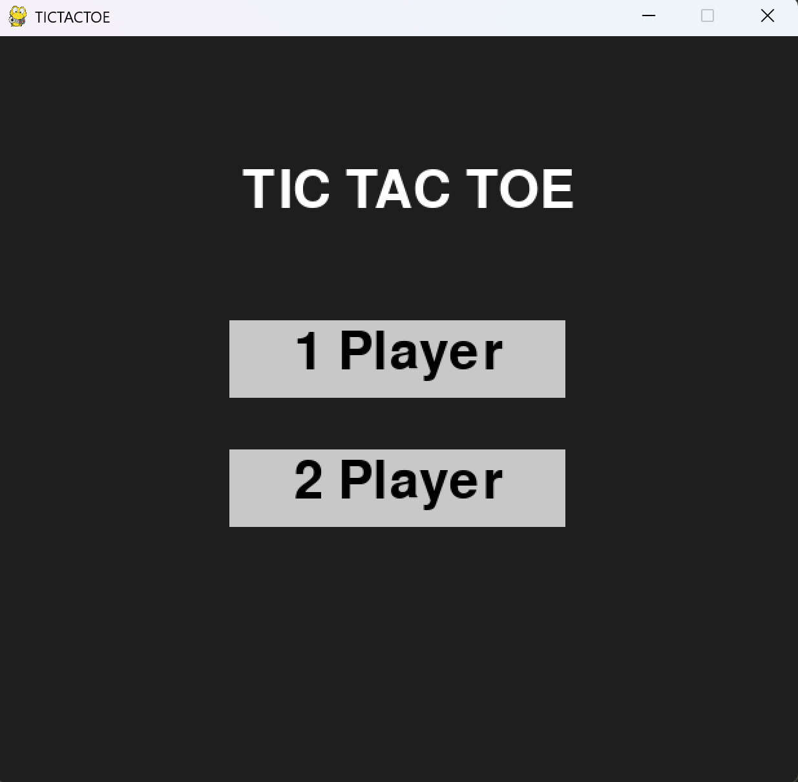
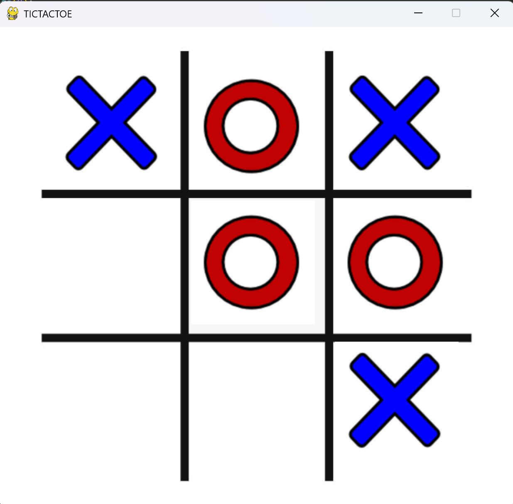
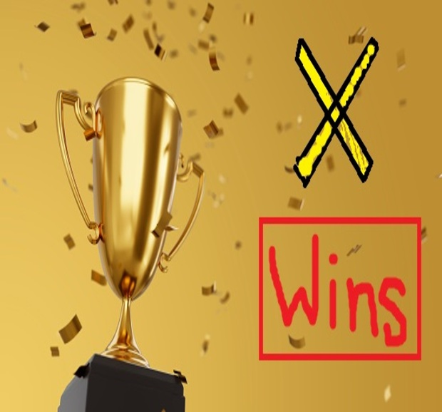

# 🧠 Tic Tac Toe with AI | Pygame 🎮


Welcome to a modern take on the classic **Tic Tac Toe** game!  
Built using **Python** and **Pygame**, this game features:

- 🧍 **Single Player Mode** — play against an unbeatable AI using the **Minimax algorithm**
- 👥 **Two Player Mode** — challenge a friend on the same device
- 🎨 Beautiful UI with images for grid and symbols
- 🔁 End screen with **"Play Again"** and **"Quit"** buttons (with rounded styles!)

---

## 📸 Screenshots

> Add screenshots here (optional):  
>   
>   
>   

---

## 🚀 Features

- 🎯 **Minimax AI**: Never loses. Perfect for learning game AI logic.
- 🧑‍🤝‍🧑 2-Player Support: Share your keyboard or mouse for fun with a friend.
- 🖼️ Custom **image-based UI**: No boring squares here—everything’s image-rendered.
- 🔁 **"Play Again" button** resets the game to the home screen.
- ❌ **"Quit" button** closes the app instantly.

---

## 📁 Folder Structure

```
tic-tac-toe-game/
│
├── images/
│   ├── grid2.png          # Game grid background
│   ├── img_x.png          # X symbol image
│   ├── img_o.png          # O symbol image
│   ├── win_x.jpg          # Win screen for player X
│   ├── win_o.jpg          # Win screen for player O
│   └── win_t.jpg          # Tie game screen
│
├── main.py                # Main Pygame application
├── README.md              # This file ✨
└── .gitignore             # Ignored system files like __pycache__
```

---

## 🎮 How to Play

### ▶️ Start the game
```bash
python main.py
```

### 🕹️ Modes
- **1 Player**: Play against AI (you are X, AI is O)
- **2 Player**: Alternate turns with a friend

---

## 🤖 How the AI Works

This game uses the **Minimax algorithm** for the AI. It simulates all possible future states of the board and chooses the best move to either:
- Maximize its chance of winning
- Or minimize your chance of winning (if it can’t win)

Result: ❌ You can’t beat it.

---

## ✅ Requirements

- Python 3.6+
- Pygame

Install Pygame:
```bash
pip install pygame
```

---

## 💡 Learning Goals

- 🧩 Game loop structure with `pygame`
- 🧠 Implementing AI using recursion (Minimax)
- 🖼️ UI layout using custom images
- 🎮 Input handling with `pygame.Rect`

---

## 🌟 Contributing

Got ideas to add:
- Online Multiplayer?
- Difficulty settings?
- Sound effects?

PRs and forks welcome!  
Feel free to submit issues, feedback, or improvements.

---

## 📜 License

This project is open-source under the [MIT License](LICENSE).
